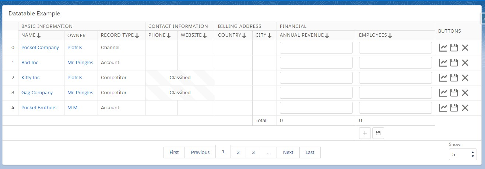

# Salesforce Developer Toolkit
## Introduction
Small library for Apex Developers 

## [Collections](https://github.com/amorek/sfdc-toolkit)
This utility class contains methods for the most common operations on Salesforce collections:
- mapping by field
- groupping by field
- filtering
- finding
- sorting
- wrapping into wrapper classes
- filling lists with clones.
- others 

All methods in this class can be used as a wrapper on list instance and chained ala lambda:
```apex
Map<Boolean, List<OpportunityWrapper>> actual = (Map<Boolean, List<OpportunityWrapper>>)
    new Collection(opportunities)
        .filter(Opportunity.CreatedDate, '>=', Date.today().addDays(-3))
        .filter(new CollectionFilters.ByFieldValues(Opportunity.StageName,'IN', new Set<Object>{'Analysis','Presales'}))
        .forEach(new AppendIndexToOpportunityNameWorker())
        .wrap(OpportunityWrapper.class)
        .groupBy(new WrapperByOpenActivityMapper());
```
or as static methods
```apex
List<Account> accounts = Collection.filter(accounts, new TriggeredAccountsFilter());

List<Account> relatedToParentIds = Collection.filter(accounts, new CollectionFilters.RelatedTo(parentAccounts, Account.ParentId));
```
Many of these methods are based on Javascript Array methods.

#### Methods:


<br/>
<br/>


##### getUniqueValues()
Return Set of values gathered from given collection items.
Values are gathered by implementation of KeyMapper, which extracts value from entity, but it's also possible
to use shorthand methods for SObjects, which call in-built implementations.

###### Methods:
```apex
Object getUniqueValues(SObjectField field)
Object getUniqueValues(Type valueType, String field)
Object getUniqueValues(KeyMapper keyMapper)
Set<Object> getUniqueValues(List<SObjectField> fields)

static Object getUniqueValues(List<SObject> records, SObjectField field) 
static Object getUniqueValues(Type valueType, List<SObject> records, String field) 
static Object getUniqueValues(List<Object> records, KeyMapper keyMapper) 
static Set<Object> getUniqueValues(List<SObject> records, List<SObjectField> fields) 
```


###### Examples
```apex
/*Static through SObject field*/
Set<String> accountNames = (Set<String>) Collection.getUniqueValues(accounts, Account.Name);

/*Through instance*/
Set<Datetime> accountCreatedDates = (Set<Datetime>) new Collection(accounts).getUniqueValues(Account.Datetime);

/*Through String field. Values type has to be provided.*/
Set<Id> parentAccountIds = (Set<Id>) Collection.getUniqueValues(Id.class, accounts, 'ParentId');

/*From non-SObject entities through KeyMapper interface implementation*/
Set<Id> parentAccountIds = (Set<Id>) new Collection(accountWrappers).getUniqueValues(new GetAccountWrapperIds());

/*From many fields*/
Set<Id> parentAccountIds = (Set<Id>) new Collection(accounts).getUniqueValues(new Set<SObjectField>{Account.ParentId, Account.Parent__c});

```


<br/>
<br/>

##### mapBy
Map collection items using: 
- KeyMapper implementation (Map's key is generated by KeyMapper, while collection item is the value)
- Mapper implementation (Both map's key and value are generated by Mapper)
- Shorthand methods which use in-built implementations:
    - Map by SObject field
    

###### Methods:
```apex
Object mapBy(SObjectField field)
Object mapBy(Type keyType, String field)
Object mapBy(KeyMapper mapper)
Object mapBy(Mapper mapper)

static Object mapBy(List<SObject> records, SObjectField field)
static Object mapBy(Type keyType, List<SObject> records, String field)
static Object mapBy(List<Object> items, KeyMapper mapper)
static Object mapBy(List<Object> items, Mapper mapper)
```


###### Inbuilt implementations:
```apex
CollectionMappers.ByField(SObjectField field) - Maps SObject by given field
CollectionMappers.ByFieldPair(SObjectField fieldLeft, String separator, SObjectField fieldRight) - Maps SObject by pair of fields
```

###### Interfaces
```
    /**
     * KeyMapper implementations determine Map's key for given object and key's type.
     */
    public interface KeyMapper {
        Object key(Object item);
        Type keyType();
    }

    /**
     * Mapper implementations determine Map's key and value for given object and types of key and value.
     */
    public interface Mapper {
        Type keyType();
        Type valueType();
        Object key(Object item);
        Object value(Object item);
    }
```

###### Examples
```apex
/*Shorthand method to maps Accounts by Name field*/
Map<String, Account> accountByNames = (Map<String, Account>) Collection.mapBy(accounts, Account.Name);

/*Shorthand method to maps Accounts by Name field (given as string)*/
Map<String, Account> accountByNames = (Map<String, Account>) new Collection(accounts).mapBy(String.class, 'Name');

/** Maps by custom Mapper implementation, which generates both map's key and value*/
Map<Id, AccountWrapper> accountWrappersByParent = (Map<Id, AccountWrapper>) Collection.mapBy(accounts, new AccountWrapperByIdMapper());

private class AccountWrapperByIdMapper implements Mapper{
    public Type keyType() {
        return Id.class
    }
    public Type valueType() {
        return AccountWrapper.class;
    }

    public Object key(Object item) {
        return ((Account) item).Id;
    }

    public Object value(Object item) {
        return new AccountWrapper((Account) item);
    }
}
```


<br/>
<br/>


##### groupBy
Groups collection items by given Mapper/KeyMapper implementation to Map<Key, List<Value>>, where Key is produced
by Mapper and Map's value is list of collection items with the same map key.
This method can be used with:
- KeyMapper implementation (Map's key is generated by KeyMapper, while collection item is the value)
- Mapper implementation (Both map's key and value are generated by Mapper)
- Shorthand methods which use in-built implementations:
    - Map by SObject field

    
###### Methods:
```apex
Object groupBy(SObjectField field)
Object groupBy(Type keyType, String field)
Object groupBy(KeyMapper keyMapper)
Object groupBy(Mapper mapper)

static Object groupBy(List<SObject> records, SObjectField field) 
static Object groupBy(Type keyType, List<SObject> records, String field) 
static Object groupBy(List<Object> items, KeyMapper keyMapper) 
static Object groupBy(List<Object> items, Mapper mapper) 
```
    
###### Inbuilt implementations:
```apex
CollectionMappers.ByField - Maps SObject by given field
CollectionMappers.ByFieldPair - Maps SObject by pair of fields
```

###### Examples
```apex
//Shorthand method using SObject field
Map<String, List<Opportunity>> actual = (Map<String, List<Opportunity>>) Collection.groupBy(opportunities, Opportunity.NextStep);
```


<br/>
<br/>


##### filter
Filters records and return only these accepted by Filter implementation.
SObject collections can be filtered by shorthand methods that use inbuilt Filter implementations (CollectionFilters.cls).

###### Methods:
```apex
Collection filter(SObjectField field, String operator, Object value)
Collection filter(Filter filter)
Collection filter(Map<Id, SObject> oldMap, UpdateFilter filter)

static List<SObject> filter(List<SObject> records, SObjectField field, String operator, Object value)
static List<Object> filter(List<Object> items, Filter filter)
static List<SObject> filter(List<SObject> records, Map<Id, SObject> oldRecords, UpdateFilter filter)
```    

###### Interfaces
```apex
/*
* Filter determines whether collection item should be included into result collection of filter method.
* */
public interface Filter {
    Boolean accepts(Object item);
}

/*
* Filter determines whether collection item should be included into result collection of filter method.
* This kind of filter compares current record value with Trigger.old value.
* */
public interface UpdateFilter {
    Boolean accepts(SObject record, SObject oldRecord);
}
```    


###### Inbuilt Implementations (CollectionFilters)
```apex
// Returns records with given field value
CollectionFilters.ByFieldValue(SObjectField field, String operator, Object value)

// Returns records where field may have one of many values
CollectionFilters.ByFieldValues(SObjectField field, String operator, Set<Object> values)

// Returns records with fields same as in prototype record
CollectionFilters.ByPrototype(SObject prototype)

// Returns records related to given parents
CollectionFilters.RelatedTo(List<SObject> parents, SObjectField relationshipField)

// Returns records close to given distance
CollectionFilters.ByDistance(SObjectField locationField, Location targetLocation, Double maxDistance, String unit)


Update Filters:

// Returns records that changed value /technical filter used in U
CollectionFilters.FieldChanged(SObjectField field, Object fromValue, Object toValue)
```    


###### Examples
```apex
new Collection(opportunities).filter(Opportunity.Name, '==', 'Something');
new Collection(opportunities).filter(Opportunity.Amount, '>', 1000);
new Collection(opportunities).filter(Opportunity.CreatedDate, '<=', Datetime.now().addMonth(1));


List<Opportunity> opportunities = Collection.filter(opportunities, oldMap, new OpportunityChangedNameFilter());
List<Opportunity> opportunities = (List<Opportunity>) new Collection(opportunities)
        .filter(oldMap, new OpportunityChangedNameFilter())
        .toList();
        

private class OpportunityChangedNameFilter implements Collection.UpdateFilter {
    public Boolean accepts(Object record, Object oldRecord) {
        return ((Opportunity) record).Name != ((Opportunity) oldRecord).Name;
    }
}
 
 
        
Collection.filter(opportunities, oldMap, new CollectionFilters.FieldChanged(Opportunity.Name, 'from', 'to'));
Collection.filter(opportunities, oldMap, new CollectionFilters.FieldChanged(Opportunity.Name, Collection.ANY_VALUE, Collection.ANY_VALUE));

new Collection(opportunities)
    .filter(new CollectionFilters.FieldChanged(Opportunity.Name, Collection.ANY_VALUE, 'Aqua Opportunities'))
    .mapBy(Opportunity.Name);


Set<Datetime> relatedOppCreatedDates = (Set<Datetime>)
        new Collection(opportunities)
                .filter(new CollectionFilters.RelatedTo(accounts, Opportunity.AccountId))
                .getUniqueValues(Opportunity.CreatedDate);
                
                
Collection.filter(opportunities, new CollectionFilters.ByFieldValues(Opportunity.StageName, 'IN', acceptedStages));
Collection.filter(opportunities, new CollectionFilters.ByFieldValues(Opportunity.StageName, 'NOT IN', acceptedStages));

new Collection(opportunities)
    .filter(new Opportunity(AccountId = account.Id, Parent__c = parent.Id, Amount = 1000))
    .toList();

```    


<br/>
<br/>


##### find
Returns first collection element accepted by filter.

###### Methods:
```apex
SObject find(SObjectField field, String operator, Object value) 
Object find(Filter filter)
static SObject find(List<SObject> records, SObjectField field, String operator, Object value)
static Object find(List<Object> items, Filter filter)
```
 
###### Examples
```apex
Opportunity actual = (Opportunity) new Collection(opportunities).find(Opportunity.FiscalQuarter, '==', 3);
Opportunity actual = (Opportunity) new Collection(opportunities).find(new OpportunityNameContainsFilter('5'));

private class OpportunityNameContainsFilter implements Collection.Filter {
    private String expr;

    public OpportunityNameContainsFilter(String expr) {
        this.expr = expr;
    }

    public Boolean accepts(Object item) {
        return ((Opportunity) item).Name.contains(expr);
    }
}
```    


<br/>
<br/>


##### sort()
Sorts collection using given comparator. This is different from List.sort() which requires each collection element
to implement Comparable interface. 
Instead Comparator interface is used. 

###### Methods:
```apex
public Collection sort(SObjectField field, Boolean isAscending)
public Collection sort(Comparator comparator)

static List<SObject> sort(List<SObject> records, SObjectField field, Boolean isAscending)
static List<Object> sort(List<Object> items, Comparator comparator)
```

###### Interfaces
```apex
    /**
     * Compares 2 objects to determine their order.
     * The implementation of this method should return the following values:
     * 0 if thisItem and otherItem are equal
     * > 0 if thisItem is greater than otherItem
     * < 0 if thisItem is less than otherItem
     */
    public interface Comparator {
        Integer compare(Object thisItem, Object otherItem);
    }
```

###### Inbuilt Implementations (CollectionFilters)
```apex
//Compares 2 records by given field and order
CollectionComparators.ByField(SObjectField field, Boolean isAscending)

//Compares 2 records by distance to given geolocation
CollectionComparators.ByDistance(SObjectField field, Location geoLocation, Boolean closestFirst, Boolean nullFirst)
```

###### Examples
```apex
List<Opportunity> sortedOpportunities = Collection.sort(opportunities, Opportunity.CreatedDate, true);

new Collection(opportunities)
                .sort(Opportunity.FiscalQuarter, true)
                .wrap(OpportunityWrapper.class);

List<Opportunity> actual = (List<Opportunity>) new Collection(opportunities)
        .sort(new ReverseProbabilityComparator())
        .toList();

private class ReverseProbabilityComparator implements Collection.Comparator {
    public Integer compare(Object thisItem, Object otherItem) {
        Opportunity thisOpp = (Opportunity) thisItem;
        Opportunity otherOpp = (Opportunity) otherItem;

        if (thisOpp.Probability < otherOpp.Probability) {
            return 1;

        } else if (thisOpp.Probability > otherOpp.Probability) {
            return -1;

        } else {
            return 0;
        }
    }
}
```    


<br/>
<br/>


##### wrap()
Wraps collection items into wrapper classes.

###### Methods:
```apex
Collection wrap(Type wrapperType);
static List<Wrapper> wrap(List<Object> items, Type wrapperType);
```

###### Interfaces
```apex
/**
 * Wrapper interface.
 * Concrete method implementing this interface should have a member variable for wrapped item.
 * wrap method should set that member variable or wrapper fields.
 */
public interface Wrapper {
    void wrap(Object item);
}
```

###### Examples
```apex
List<OpportunityWrapper2> wrappers = (List<OpportunityWrapper2>) Collection.wrap(opportunities, OpportunityWrapper2.class);

List<OpportunityWrapper2> wrappers = (List<OpportunityWrapper2>)
    new Collection(opportunities)
            .filter(Opportunity.NextStep, '==', 'Analysis')
            .wrap(OpportunityWrapper2.class)
            .toList();


public class OpportunityWrapper2 implements Collection.Wrapper {
    public Opportunity opportunity;

    public void wrap(Object item) {
        this.opportunity = (Opportunity) item;
    }

    public String getName() {
        return opportunity.Name;
    }
}
```    


 
<br/>
<br/>


##### reduce()
Equivalent of Javascript's Array.reduce.
Executes reducer implementations on each member of collection resulting in single output value.
###### Methods:
```apex
    Object reduce(Reducer reducer, Object result)
    static Object reduce(List<Object> items, Reducer reducer, Object result)
```

###### Interfaces
```apex
    /**
     * @param aggregatedValues Collection which holds values reduced so far.
     * @param item currently processed item.
     * @return aggregatedValues
     */
    public interface Reducer {
        Object reduce(Object aggregatedValues, Object item, Integer index);
    }
```

###### Examples
```apex
Decimal expected = 0;
for (Opportunity opportunity : opportunities) {
    expected += opportunity.Amount;
}

Decimal actual = (Decimal) new Collection(opportunities).reduce(new ReducerToOppAmountTotal(), 0);

System.assertEquals(expected, actual);


private class ReducerToOppAmountTotal implements Collection.Reducer {
    
    public Object reduce(Object aggregatedAmount, Object item, Integer index) {
        return ((Decimal) aggregatedAmount) + ((Opportunity) item).Amount;
    }
}
```    


<br/>
<br/>


##### forEach()
Executes action on each item of collection. This method can be useful in chaining.

###### Methods:
```apex
Collection forEach(Worker worker)
static void forEach(List<Object> items, Worker worker)
```

###### Interfaces
```apex
/**
 * Worker performs action on each item in collection.
 */
public interface Worker {
    void forEach(Object item, Integer index);
}
```

###### Examples
```apex
new Collection(opportunities)
        .filter(Opportunity.CreatedDate, '>=', Date.today().addDays(-3))
        .forEach(new AppendIndexToOpportunityNameWorker())
        .wrap(OpportunityWrapper2.class);
        
private class AppendIndexToOpportunityNameWorker implements Collection.Worker {
    public void forEach(Object item, Integer index) {
        ((Opportunity) item).Name += index;
    }
}
```    


<br/>
<br/>


##### fill()
Fills in the list with number of clones of provided prototype record.
By default, clone is deep and Id, timestamps and autonumbers are not preserved.

###### Methods:
```apex
Collection fill(Integer count, SObject prototype)
Collection fill(Integer count, SObject prototype, CloneOptions cloneOptions)

static List<SObject> fill(List<SObject> listToFill, Integer count, SObject prototype)
static List<SObject> fill(List<SObject> listToFill, Integer count, SObject prototype, CloneOptions opts)

```

###### Options
```apex
public class CloneOptions {
    public Boolean
            preserveId,
            deepClone,
            preserveReadonlyTimestamps,
            preserveAutonumer;

    public CloneOptions(Boolean preserveId, Boolean deepClone, Boolean preserveReadonlyTimestamps, Boolean preserveAutonumer) {
        this.preserveId = preserveId;
        this.deepClone = deepClone;
        this.preserveReadonlyTimestamps = preserveReadonlyTimestamps;
        this.preserveAutonumer = preserveAutonumer;
    }
}
```

###### Examples
```apex
List<Account> accounts = (List<Account>)
    new Collection(new List<Account>())
            .fill(10, new Account(Name = 'Test Account', Contact__r = contact))
            .fill(10, new Account(Name = 'Other Account', Contact__r = contact),
            new Collection.CloneOptions(false, false, false, false))
            .toList();
```    


<br/>
<br/>


##### Utility methods
###### IsEmpty / isNotEmpty
NPE safe methods to check whether collection is empty or null.
```apex
public Boolean isNotEmpty();
public Boolean isEmpty();
static Boolean isNotEmpty(List<Object> collection)
static Boolean isEmpty(List<Object> collection)
```

###### Examples
```apex
System.assertEquals(true, Collection.isEmpty(null));
System.assertEquals(true, Collection.isEmpty(new List<String>()));
System.assertEquals(true, new Collection(null).isEmpty());
System.assertEquals(true, new Collection(new List<String>()).isEmpty());
```

###### public static Object cast(Object collection, Type targetType)
Forcefully transforms running type of the collection to specified type.

    Ex. Map<Object,Object> => Map<String,Account>
Casting is done through JSON serialization/deserialization, this process is CPU Time consuming.

This method is NPE-safe, when collection is null, then blank instance of target type is returned.
    
###### public static Type getListItemType(List&lt;Object&gt; o)
Return running type of Collections single item.
    
    Ex. for List<Account> => Account.class

###### static getType(Object o)
Returns running type of given object.


<br/>
<br/>

## Datatable
Probably the most robust datatable implementation in the world. 
There are like 50% chances that it's the best, otherwise it's not.

In my opinion, this is how standard lightning:datatable should have looked like.
It's declarative datatable design where all headers, footers and rows are declared in the component markup.

Nothing is configured in the controller. User can bind rendered rows with container component's variables, controller
or even control table columns rendering based on row's item values.

Features:
- Configured through markdown
- Fully customizable header and footer
- Datatable column can take expressions or components as body
- Column's components can be bound to container controller actions
- Pagination (can be replaced with custom implementation)
- Sorting


@see DatatableExample.cmp for full example
 


```xhtml

<!--
Items, var and itemVar corresponds to aura:iteration attributes with the same names.
Datatable will iterate over accounts, in "body" facet, each account can be access by "account" variable.
-->
<c:Datatable items="{!v.accounts}" var="account" paginate="true" bordered="true" responsive="true"
                     indexVar="index">

    <aura:set attribute="header">
    
        <!--<tr> can be used instead of c:DatatableRow-->
        <c:DatatableRow>
            <c:DatatableColumn/>
            <!--Basic Information-->
            <c:DatatableHeader value="Name" sortable="true" sortField="Name"/>
            <c:DatatableHeader value="Owner"/>
            
            <!--Comparator is a function(a,b) which returns integer with comparision result
            Comparator functions has to be declared in "init" and saved in view variable.
            -->
            <c:DatatableHeader value="Record Type" sortable="true" comparator="{!v.comparators.RecordType}"/>

            <!--Contact Information-->
            <c:DatatableHeader value="Phone" sortable="true" sortField="Phone"/>
            <c:DatatableHeader value="Website" sortable="true" sortField="Website"/>

            <!--Billing Address-->
            <c:DatatableHeader value="Country" sortable="true" sortField="BillingCountry"/>
            <c:DatatableHeader value="City" sortable="true" sortField="BillingCity"/>

            <!--Finance-->
            <c:DatatableHeader value="Annual Revenue" sortable="true" sortField="AnnualRevenue"/>
            <c:DatatableHeader value="Employees" sortable="true" sortField="NumberOfEmployees"/>
        </c:DatatableRow>
    </aura:set>


    <aura:set attribute="body">
        <!--These row/s are rendered for each Account-->
        <c:DatatableRow>
            <!--Basic Information-->
            
            <!--Value attribute is shorthand for specifying value in DatatableColumn body-->
            <c:DatatableColumn label="Index" value="{!index}"/>
            
            <c:DatatableColumn label="Name">
                <!--Virtually any content can be put here, inputs, buttons, other datatable etc.-->
                <a href="{!'/' + account.Id}">{!account.Name}</a>{!i}
            </c:DatatableColumn>

            <c:DatatableColumn label="Owner">
                <a href="{!'/' + account.OwnerId}">{!account.Owner.Name}</a>
            </c:DatatableColumn>

            <c:DatatableColumn label="Record Type" value="{!account.RecordType.Name}"/>


            <!--Contact Information-->

            <!--You can bind both parent component variables/actions and current row fields-->
            <aura:if isTrue="{!account.RecordType.Name != 'Competitor'}">
                <c:DatatableColumn label="Phone" value="{!account.Phone}"/>
                <c:DatatableColumn label="Website" value="{!account.Website}"/>

                <aura:set attribute="else">
                    <c:DatatableColumn label="Contact Information" colspan="2"
                                       class="slds-text-align_center slds-theme--alert-texture">
                        Classified
                    </c:DatatableColumn>
                </aura:set>
            </aura:if>


            <!--Billing Address-->
            <c:DatatableColumn label="Billing Country" value="{!account.BillingCountry}"/>
            <c:DatatableColumn label="Billing City" value="{!account.BillingCity}"/>

            <!--Finance-->
            <c:DatatableColumn label="Annual Revenue">
                <!--Input will be bound to row's account field and to controller's action-->
                <lightning:input type="number" 
                                 value="{!account.AnnualRevenue}" 
                                 variant="label-hidden"
                                 onchange="{!c.handleInputChange}"/>
            </c:DatatableColumn>

            <c:DatatableColumn label="Number of Employees">
                <lightning:input type="number" 
                                 value="{!account.NumberOfEmployees}" 
                                 variant="label-hidden"
                                 onchange="{!c.handleInputChange}"/>
            </c:DatatableColumn>

            <!--Buttons-->
            <c:DatatableColumn label="Buttons">
                <lightning:buttonIcon alternativeText="Report" iconName="utility:graph" size="large"
                                      variant="bare"/>
                <lightning:buttonIcon alternativeText="Update" iconName="utility:save" size="large"
                                      variant="bare"/>
                <lightning:buttonIcon name="{!account.Id}" alternativeText="Delete" iconName="utility:close"
                                      size="large" onclick="{!c.handleDeleteAccount}"
                                      variant="bare"/>
            </c:DatatableColumn>
        </c:DatatableRow>
    </aura:set>


    <aura:set attribute="footer">
        <!--Totals-->
        <c:DatatableRow>
            <c:DatatableColumn colspan="7"/>
            <c:DatatableColumn label="Total" value="Total"/>
            <c:DatatableColumn label="Total Revenue" value="{!v.totalRevenue}"/>
            <c:DatatableColumn label="Total Employees" value="{!v.totalEmployees}"/>
            <c:DatatableColumn/>
        </c:DatatableRow>
    </aura:set>

</c:Datatable>

```
 


<br/>
<br/>

## XML Serialization / Deserialization tool
Small utility class which binds class hierarchies with XmlNode, which allows for automatic 
serialziation from class hierarchy to XML document and deserialization
from XML string to hierarchy of classes.

@see XmlNodeTest for examples

Usage:

```apex
/**
 * @description
 * Envelope class structure and all it's data are transformed into proper XML request,
 * maintaining proper namespaces, node names and attributes according to registerXML() implementations.
 * Resulting XML is then loaded by another instance and serialized again to make sure, that consecutive serialization
 * and deserialization yields the same result.
 */
@IsTest
static void testRequestEnvelopeStructureIsSerializedToTheXMLProperly() {
    Envelope envelope = new Envelope(
            new Header('api.user', 'secret'),
            new SampleRequest(ExclusionMode.DuplicateEmail,
                    new Criteria(
                            'Personal Data', 'John', 'Doe', 'John.Doe@sample.com', Datetime.newInstance(1980, 01, 01),
                            new List<Address>{
                                    new Address('UK', 'London', 'Test Street 2'),
                                    new Address('UK', 'Bridgetown', 'Other Street 2')
                            }
                    )
            )
    );

    String expectedXML = ('<?xml version="1.0" encoding="UTF-8"?>'
            + '<soap:Envelope xmlns:soap="http://schemas.xmlsoap.org/soap/envelope/"'
            + ' xmlns:xsi="http://www.w3.org/2001/XMLSchema-instance" xmlns:xsd="http://www.w3.org/2001/XMLSchema">'
            + '    <soap:Header>'
            + '        <username>api.user</username>'
            + '        <password>secret</password>'
            + '    </soap:Header>'
            + '    <soap:Body>'
            + '        <SampleRequest xmlns="http://sample.test/webservices/">'
            + '            <exclusion>DuplicateEmail</exclusion>'
            + '            <criteria type="Personal Data">'
            + '                <FirstName>John</FirstName>'
            + '                <LastName>Doe</LastName>'
            + '                <Email>John.Doe@sample.com</Email>'
            + '                <Username>John.Doe@sample.com</Username>'
            + '                <DateOfBirth>01/01/1980</DateOfBirth>'
            + '                <Address>'
            + '                    <Country>UK</Country>'
            + '                    <AddressLine1>London</AddressLine1>'
            + '                    <AddressLine2>Test Street 2</AddressLine2>'
            + '                </Address>'
            + '                <Address>'
            + '                    <Country>UK</Country>'
            + '                    <AddressLine1>Bridgetown</AddressLine1>'
            + '                    <AddressLine2>Other Street 2</AddressLine2>'
            + '                </Address>'
            + '            </criteria>'
            + '        </SampleRequest>'
            + '    </soap:Body>'
            + '</soap:Envelope>').replaceAll('\\>\\s+<', '><');

    String actual = envelope.toXmlString();
    System.assertEquals(expectedXML, actual);


    Envelope envelope2 = new Envelope(
            new Header('api.user', 'secret'),
            new SampleRequest()
    );

    envelope2.load(actual);
    String actual2 = envelope2.toXmlString();
    System.assertEquals(actual, actual2);
}
```

```apex
/**
 * @description
 * XML string is deserialized by given Envelope class structure.
 * XML text node values are parsed to the correct types and are available on the Envelope instance after loading xml.
 * After loading XML, Envelope is serialized again and the result should be the same as initial response xml.
 */
@IsTest
static void testResponseIsDeserializedToEnvelopeStructure() {
    String responseXML =
            ('<?xml version="1.0" encoding="UTF-8"?>'
                    + '<soap:Envelope xmlns:soap="http://schemas.xmlsoap.org/soap/envelope/"'
                    + ' xmlns:xsi="http://www.w3.org/2001/XMLSchema-instance" xmlns:xsd="http://www.w3.org/2001/XMLSchema">'
                    + '    <soap:Header>'
                    + '        <username>api.user</username>'
                    + '        <password>secret</password>'
                    + '    </soap:Header>'
                    + '    <soap:Body>'
                    + '        <SampleResponse xmlns="http://sample.test/webservices/">'
                    + '            <matches>'
                    + '                <match>'
                    + '                    <FirstName>John</FirstName>'
                    + '                    <LastName>Doe</LastName>'
                    + '                    <Score>1</Score>'
                    + '                    <Weight>69.5</Weight>'
                    + '                    <Height>182</Height>'
                    + '                    <Distance>4000000</Distance>'
                    + '                    <Married>true</Married>'
                    + '                </match>'
                    + '                <match>'
                    + '                    <FirstName>Johan</FirstName>'
                    + '                    <LastName>Liebert</LastName>'
                    + '                    <Score>0.5</Score>'
                    + '                    <Weight>80.1</Weight>'
                    + '                    <Height>190</Height>'
                    + '                    <Distance>5000000</Distance>'
                    + '                    <Married>false</Married>'
                    + '                </match>'
                    + '            </matches>'
                    + '        </SampleResponse>'
                    + '    </soap:Body>'
                    + '</soap:Envelope>').replaceAll('\\>\\s+<', '><');

    Envelope envelope = new Envelope(
            new Header(),
            new SampleResponse()
    );
    envelope.load(responseXML);

    Map<String, Object> expected = new Map<String, Object>{
            'body' => new Map<String, Object>{
                    'content' => new Map<String, Object>{
                            'matches' => new List<Object>{
                                    new Map<String, Object>{
                                            'weight' => 69.5,
                                            'score' => 1,
                                            'lastName' => 'Doe',
                                            'isMarried' => true,
                                            'height' => 182,
                                            'firstName' => 'John',
                                            'distance' => 4000000
                                    },
                                    new Map<String, Object>{
                                            'weight' => 80.1,
                                            'score' => 0.5,
                                            'lastName' => 'Liebert',
                                            'isMarried' => false,
                                            'height' => 190,
                                            'firstName' => 'Johan',
                                            'distance' => 5000000
                                    }
                            }
                    }
            },

            'header' => new Map<String, Object>{
                    'password' => 'secret',
                    'username' => 'api.user'
            }
    };
    Map<String, Object> actual = (Map<String, Object>) JSON.deserializeUntyped(JSON.serialize(envelope));
    System.assertEquals(expected, actual);
    System.assertEquals(responseXML, envelope.toXmlString());
}
```

Hierarchy of classes using XMLNode
```apex
private final static String
            NAMESPACE_XSI = 'http://www.w3.org/2001/XMLSchema-instance',
            NAMESPACE_XSD = 'http://www.w3.org/2001/XMLSchema',
            NAMESPACE_SOAP = 'http://schemas.xmlsoap.org/soap/envelope/',
            NAMESPACE_SAMPLE = 'http://sample.test/webservices/';


/*Root Element must extend XmlRootNode*/
private class Envelope extends XmlNode.XmlRootNode {
    /*It's important to have all nodes initialized. Otherwise they will be omitted.*/
    public Body body = new Body();
    public Header header = new Header();

    public Envelope() {
    }
    public Envelope(Header header, BodyContent content) {
        this.header = header;
        this.body = new Body(content);
    }

    protected override void registerXML(XmlNode.Context ctx) {
        /*Root node has to call registerRootNode() as first entry in registerXML()*/
        registerRootNode('Envelope', NAMESPACE_SOAP, 'soap');

        /*Namespaces of the root element*/
        registerNamespace('xsi', NAMESPACE_XSI);
        registerNamespace('xsd', NAMESPACE_XSD);
        registerNamespace('soap', NAMESPACE_SOAP);

        /*registerChild() will create a Dom.XMLNode with given specs for the child element and pass it
        * for futher processing to header element*/
        registerChild(header, 'Header', NAMESPACE_SOAP, 'soap');
        registerChild(body, 'Body', NAMESPACE_SOAP, 'soap');
    }
}

private class Header extends XmlNode {
    public String username;
    public String password;

    public Header() {
    }
    public Header(String username, String password) {
        this.username = username;
        this.password = password;
    }

    protected override void registerXML(XmlNode.Context ctx) {
        /*Passed value is important in serialization, returned in deserialization*/
        this.username = (String) registerTextNode(String.class, 'username', null, null, username);
        this.password = (String) registerTextNode(String.class, 'password', null, null, password);
    }
}

private class Body extends XmlNode {
    public BodyContent content;

    public Body() {
    }
    public Body(BodyContent content) {
        this.content = content;
    }

    protected override void registerXML(XmlNode.Context ctx) {
        registerChild(content, content.getNodeName(), NAMESPACE_SAMPLE, '');
    }
}


/**
* Abstract type which will be super type for all request and response elements that
* reside in Body element.
* */
private abstract class BodyContent extends XmlNode {
    public abstract String getNodeName();
}

/**
* Sample SOAP Request which will contain 1 Criteria element and
* a text element with predefined values (values are made up)
* */
private class SampleRequest extends BodyContent {
    public ExclusionMode exclusionType = ExclusionMode.None;
    public Criteria criteria = new Criteria();

    public SampleRequest() {
    }
    public SampleRequest(ExclusionMode exclusionType, Criteria criteria) {
        this.exclusionType = exclusionType;
        this.criteria = criteria;
    }

    protected override void registerXML(XmlNode.Context ctx) {
        /*Enums are automatically deserialized from the XML string as well*/
        this.exclusionType = (ExclusionMode) registerTextNode(ExclusionMode.class, 'exclusion', NAMESPACE_SAMPLE, '', exclusionType);
        registerChild(criteria, 'criteria', NAMESPACE_SAMPLE, '');
    }

    public override String getNodeName() {
        return 'SampleRequest';
    }
}
public enum ExclusionMode {
    None,
    DuplicateEmail,
    DuplicateName,
    All
}

private class Criteria extends XmlNode {
    public String criteriaType;
    public String firstName;
    public String lastName;
    public String email;
    public String username;
    public Datetime dob = Datetime.now();
    public List<Address> addresses = new List<Address>();

    public Criteria() {
    }
    public Criteria(String criteriaType, String firstName, String lastName, String email, Datetime dob, List<Address> addresses) {
        this.criteriaType = criteriaType;
        this.firstName = firstName;
        this.lastName = lastName;
        this.email = email;
        this.username = email;
        this.dob = dob = dob;
        this.addresses = addresses;
    }

    protected override void registerXML(XmlNode.Context ctx) {
        this.criteriaType = (String) registerAttribute(String.class, 'type', criteriaType);
        this.firstName = (String) registerTextNode(String.class, 'FirstName', NAMESPACE_SAMPLE, '', firstName);
        this.lastName = (String) registerTextNode(String.class, 'LastName', NAMESPACE_SAMPLE, '', lastName);
        this.email = (String) registerTextNode(String.class, 'Email', NAMESPACE_SAMPLE, '', email);
        this.username = (String) registerTextNode(String.class, 'Username', NAMESPACE_SAMPLE, '', username);

        /*You can decouple deserialization and serialization using context.
        * In this case, variable is a Datetime, but we pass in String value - formatted Date.
        * registerTextNode() will always return passed value, so a String in this case.
        * I don't want to change the value during serialization, so I only handled returned date string in
        * deserialization context.
        * */
        String dobStr = (String) registerTextNode(String.class, 'DateOfBirth', NAMESPACE_SAMPLE, '', dob.format('dd/MM/YYYY'));
        if (ctx == XmlNode.Context.DESERIALIZATION) {
            this.dob = Date.parse(dobStr);
        }


        registerChildren(addresses, 'Address', NAMESPACE_SAMPLE, '', Address.class);
    }
}
private class Address extends XmlNode {
    public String country;
    public String addressLine1;
    public String addressLine2;
    public String addressLine3;
    public String addressLine4;

    public Address() {
    }
    public Address(String country, String addressLine1, String addressLine2) {
        this.country = country;
        this.addressLine1 = addressLine1;
        this.addressLine2 = addressLine2;
    }

    protected override void registerXML(XmlNode.Context ctx) {
        this.country = (String) registerTextNode(String.class, 'Country', NAMESPACE_SAMPLE, null, country);
        this.addressLine1 = (String) registerTextNode(String.class, 'AddressLine1', NAMESPACE_SAMPLE, '', addressLine1);
        this.addressLine2 = (String) registerTextNode(String.class, 'AddressLine2', NAMESPACE_SAMPLE, '', addressLine2);
        this.addressLine3 = (String) registerTextNode(String.class, 'AddressLine3', NAMESPACE_SAMPLE, '', addressLine3);
        this.addressLine4 = (String) registerTextNode(String.class, 'AddressLine4', NAMESPACE_SAMPLE, '', addressLine4);
    }
}


/**
* Sample SOAP response
* */
private class SampleResponse extends BodyContent {
    public List<Match> matches = new List<Match>();

    protected override void registerXML(XmlNode.Context ctx) {
        /*registerList() creates single List node - 'matches' using listNodeName, ListNamespace and listPrefix
        * then creates 'match' nodes inside it.
        *
        * Adequately, during deserialization single matches child is retrieved and all it's match nodes are deserialized
        * to the List<Match>
        * */
        registerList('matches', NAMESPACE_SAMPLE, '', matches, 'match', NAMESPACE_SAMPLE, '', Match.class);
    }

    public override String getNodeName() {
        return 'SampleResponse';
    }
}

private class Match extends XmlNode {
    public String firstName;
    public String lastName;
    public Decimal score;
    public Double weight;
    public Integer height;
    public Long distance;
    public Boolean isMarried;

    protected override void registerXML(XmlNode.Context ctx) {
        this.firstName = (String) registerTextNode(String.class, 'FirstName', NAMESPACE_SAMPLE, '', firstName);
        this.lastName = (String) registerTextNode(String.class, 'LastName', NAMESPACE_SAMPLE, '', lastName);
        /*During deserialization, text value of Score text node will be deserialized to Decimal*/
        this.score = (Decimal) registerTextNode(Decimal.class, 'Score', NAMESPACE_SAMPLE, '', score);
        this.weight = (Double) registerTextNode(Double.class, 'Weight', NAMESPACE_SAMPLE, '', weight);
        this.height = (Integer) registerTextNode(Integer.class, 'Height', NAMESPACE_SAMPLE, '', height);
        this.distance = (Long) registerTextNode(Long.class, 'Distance', NAMESPACE_SAMPLE, '', distance);
        this.isMarried = (Boolean) registerTextNode(Boolean.class, 'Married', NAMESPACE_SAMPLE, '', isMarried);
    }
}
```


<br/>
<br/>

## Mock Router
Very simple implementation for very common problem in Salesforce. 

While writing Unit Tests in Salesforce, we often have to ensure that Http Mocks will handle many different types of callouts.
It's not always possible to switch mock before another callout is executed, sometimes one class or trigger will 
attempt to authenticate with one callout and then send another authenticated callout.
Sometimes there are many different integrations and many different callouts called from trigger.

This is very simple, yet very robust, Chain of Responsibility design pattern implementation that handles this problem.

 
I've introduced this new interface which will replace default HttpCalloutMock in our mocks.
The only differences is the new handles() methods.
Mocks will decide whether they can handle the request in this method.
 ```apex
public interface HttpCalloutChainMock extends HttpCalloutMock {
    Boolean handles(HttpRequest request);
}
```

Then we have this Router class, which also implements HttpCalloutChainMock.

Router contains LIFO queue of HttpCalloutChainMock implementations, which are registered through registerMock method. 
When http request is issued, router will 
iterate over registered mocks and use the first one that can handle request. Since this is LIFO queue, the most recently 
registered mock will be the first one to respond to request.

Other routers can also be registered as part of routing, which lets us create whole hierarhies of routers:
 ```
 HttpCalloutChainMockRouter
     - Integration #1 Router
          - Auth Mock
          - Other Mocks...
     - Integration #2 Router
          - Auth Mock
          - Other Mocks...
     - Integration #3 Router
          - Auth Mock
          - Other Mocks...
 ```
      
 LIFO queue gives us opportunity to override default mocks. For example if we have SalesforceRestAPIMockRouter,
  which always have AuthenticationMock registered as default, 
  with LIFO queue we are able to override this with unsuccessfull authentication mock.   
 ```apex
public virtual class HttpCalloutChainMockRouter implements HttpCalloutChainMock {
 private List<HttpCalloutChainMock> registeredMocks = new List<HttpCalloutChainMock>{
         new UnsupportedRequest()
 };


 /**
 * Register HttpCalloutChainMock implementation.
 * Each registered mock in queue will be asked if it can handle the request, until the first mock that can handle.
 * New mocks are registered at the beginning of the mock queue.
 * */
 public HttpCalloutChainMockRouter registerMock(HttpCalloutChainMock handler) {
     registeredMocks.add(0, handler);
     return this;
 }


 /**
  * Responds with first registered mock which can handle the request.
  * If none if the registered mocks can handle the request, then exception is thrown.
  */
 public HttpResponse respond(HttpRequest request) {

     for (HttpCalloutChainMock mock : registeredMocks) {
         if (mock.handles(request)) {
             return mock.respond(request);
         }
     }

     return null;
 }


 /**
  * @return Boolean whether this mock class can handle the request.
  */
 public virtual Boolean handles(HttpRequest request) {
     return true;
 }
 
 ...
```

##### Example
See HttpCalloutChainMockRouterTest
```apex
/* Default mocks can be registered directly in Router of each API, 
but I decided to explicitly register all mocks in this example
*/
Test.setMock(HttpCalloutMock.class,
        new HttpCalloutChainMockRouter()
                .registerMock(
                new AcmeMocksRouter()
                        .registerMock(new AcmeAuthenticationMock())
                        .registerMock(new AcmeGetAccountsMock())
                        .registerMock(new AcmePostAccountsMock()))

                .registerMock(
                new ExampleMocksRouter()
                        .registerMock(new ExampleAuthenticationMock())
                        .registerMock(new ExampleGetAccountsMock())
                        .registerMock(new ExamplePostAccountsMock()))
                        
                        
                .registerMock(
                new SalesforceRestAPIMocks()
                        .registerMock(new SalesforceRestAPIMocks.FailAuthenticateMock())
                        .registerMock(new SalesforceRestAPIMocks.CompositeSObjectsUpdateMock())
);

...

/**
* Mock Router for ACME callouts.
* */
private class AcmeMocksRouter extends HttpCalloutChainMockRouter {

    public override Boolean handles(HttpRequest request) {
        return request.getEndpoint().contains('acme.com/rest');
    }
}

private class AcmeAuthenticationMock implements HttpCalloutChainMock {

    public Boolean handles(HttpRequest request) {
        return request.getEndpoint().contains('/auth');
    }

    public HttpResponse respond(HttpRequest param1) {
        HttpResponse response = new HttpResponse();
        response.setBody('sessionToken: abc');
        response.setStatusCode(200);

        return response;
    }
}

private class AcmeGetAccountsMock implements HttpCalloutChainMock {

    public Boolean handles(HttpRequest request) {
        return request.getEndpoint().contains('/accounts') && request.getMethod() == 'GET';
    }

    public HttpResponse respond(HttpRequest param1) {
        HttpResponse response = new HttpResponse();
        response.setStatusCode(200);
        response.setBody(JSON.serialize(new Account[]{
                new Account(Name = 'ACME Account 1'),
                new Account(Name = 'ACME Account 2'),
                new Account(Name = 'ACME Account 3')
        }));

        return response;
    }
}

private class AcmePostAccountsMock implements HttpCalloutChainMock {

    public Boolean handles(HttpRequest request) {
        return request.getEndpoint().contains('/accounts') && request.getMethod() == 'POST';
    }

    public HttpResponse respond(HttpRequest param1) {
        HttpResponse response = new HttpResponse();
        response.setStatusCode(200);
        response.setBody('{"success":"true"}');

        return response;
    }
}
....

/**
* Mock Router for Dacme callouts.
* */
private class ExampleMocksRouter extends HttpCalloutChainMockRouter {

    public override Boolean handles(HttpRequest request) {
        return request.getEndpoint().contains('example.com/rest');
    }
}
        
```