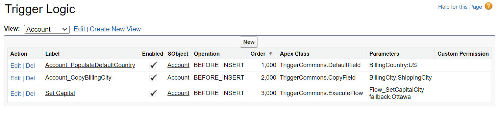

# Metadata Trigger Handler
*Custom Metadata-driven orchestrator for Apex Trigger Logic*

[Source](https://github.com/pkozuchowski/Apex-Opensource-Library/tree/master/force-app/commons/triggerHandlerMdt)
[Dependency](/apex/trigger-handler)
[Install in Sandbox](https://test.salesforce.com/packaging/installPackage.apexp?p0=04t08000000ga8uAAA)
[Install in Production](https://login.salesforce.com/packaging/installPackage.apexp?p0=04t08000000ga8uAAA)

```bash
sf project deploy start \
  -d "force-app/commons/triggerHandler" \ 
  -d "force-app/commons/triggerHandlerMdt" \
  -o sfdxOrg
```

---
# Documentation
Extension to the standard version of the Trigger Handler Framework. All standard features - such as Logic toggle are available.

Metadata Trigger Handler is a Dependency-Injection oriented pattern that moves orchestration from the code of Trigger Handler classes to the
Custom Metadata records.  
Each record defines SObject, Trigger operation, Apex Class name and optional Parameters and Custom Permission.
Framework initializes and parametrizes each of the defined classes and executes its code.



Apex Classes defined in the custom metadata must implement TriggerLogic interface:
```apex
public interface TriggerLogic {
    void execute(List<SObject> records, TriggerContext ctx);
}
```

Example of a class that copies BillingCountry to ShippingCountry when it's blank.
```apex
public class AccountShippingCountryFiller implements TriggerLogic {

    public void execute(List<Account> records, TriggerContext ctx) {
        for (Account acc : records) {
            if (ctx.isChanged(acc, Account.BillingCountry) && String.isBlank(acc.ShippingCountry)) {
                acc.ShippingCountry = acc.BillingCountry;
            }
        }
    }
}
```

To run Metadata Trigger Handler, define your trigger as follows:
```apex
trigger AccountTrigger on Account (before insert, before update, before delete, after insert, after update, after delete, after undelete) {
    TriggerDispatcher.run(new MetadataTriggerHandler());
}
```

#### Pros
- No merge conflicts in multi-work-stream environments.
- Ability to enable/disable/reorder logic without deployment.
- Enforces SOLID Principles and unified trigger interfaces.
- Introduces per-class configuration layer which can be enriched with Feature Management, performance profiling, and other features.

#### Cons
- Custom Metadata is an additive deployment, which means that deleting metadata from the source of truth does not remove it from the org.
  Depending on the situation, CI/CD pipeline or the lack of it, missed manual steps, deploying to refresh org, etc. — it's possible to have unwanted trigger
  logic running in the org without being aware of it.
- It's harder to navigate through the trigger code. Developers will have to jump between the custom metadata page and IDE to check what's executed.
- Code Analyzer may report false-positive unused classes that are only referenced in the custom metadata.

#### Recommendation
Based on my experience, it's easier to work with the code version of the trigger handler, hence why I prefer to use it on small to medium-sized projects.  
However, configuration-based also has a lot of merits-especially on enterprise-tier orgs. If you pick a configuration-based trigger handler, make sure to also read through Cons.


---
# TriggerCommons

Lightweight library of reusable trigger building blocks. Each inner class implements `TriggerLogic` and is intended to be configured from Custom Metadata (or
used directly from code). Designed for BEFORE/AFTER trigger contexts and optimized for common tasks: setting fields with formulas and invoking Flows.

## FieldSetter

Purpose: evaluate a formula per record and assign the computed value to a target field. Intended for BEFORE triggers to populate or override a field.

Parameters
- `field` — API name of the target field (required).
- `formula` — formula text evaluated in the context of each record (required).
- `replaceIfSet` — optional boolean. When `true` the computed value replaces any existing value; when `false` assignment occurs only if the target value is
  null. Default: `true`.

Behavior
- Builds a `FormulaEval.FormulaInstance` lazily using the trigger SObject type and the configured formula.
- Determines the formula return type from the target field's schema display type (boolean, date, datetime, time, id/reference, decimal/currency/percent, double,
  integer, long, otherwise string).
- If the formula return type is STRING, the formula is parsed as a template.
- For each record, evaluates the formula and assigns the result to the configured field when the target is null or `replaceIfSet` is `true`.

Notes
- Field API name must exist on the target SObject type.
- Formula evaluation happens per record; keep heavy expressions in mind for performance.